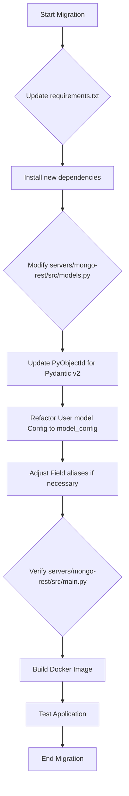

# Pydantic v2 Migration Plan for mongo-rest server

This document outlines the plan for migrating the `mongo-rest` server to Pydantic v2, including necessary code changes and Docker environment considerations.

## Overview of Changes

### `servers/mongo-rest/requirements.txt`
- Update `pydantic` to `^2.0`.
- Update `pydantic-settings` to `^2.0`.

### `servers/mongo-rest/src/models.py`
- **`PyObjectId` Class:**
  - `__get_validators__` and `validate` will be replaced by `__get_pydantic_core_schema__` and `__get_pydantic_json_schema__` for custom types in Pydantic v2.
- **`User` Model:**
  - `Config` class will be replaced by `model_config` and `model_extra` attributes.
  - `allow_population_by_field_name` becomes `model_config['populate_by_name'] = True`.
  - `json_encoders` will be handled by `model_dump_json` or custom serializers.
  - `Field(default_factory=PyObjectId, alias="_id")` will likely change to `Field(default_factory=PyObjectId, validation_alias=AliasChoices('_id', 'id'))` or similar for aliases.

### `servers/mongo-rest/src/main.py`
- No direct Pydantic v2 changes are expected here, as it primarily handles FastAPI application setup and database connection.

### `servers/mongo-rest/Dockerfile`
- The `Dockerfile` will only need to reflect the updated `requirements.txt`. No other changes are anticipated.

## Migration Plan Workflow

## Detailed Steps

1.  **Update `servers/mongo-rest/requirements.txt`:**
    *   Change `pydantic>=1.8.0` to `pydantic>=2.0.0,<3.0.0`.
    *   Change `pydantic-settings>=2.0.0` to `pydantic-settings>=2.0.0,<3.0.0`.

2.  **Modify `servers/mongo-rest/src/models.py`:**
    *   **Update `PyObjectId` for Pydantic v2 custom types:**
        *   Remove `__get_validators__` and `validate`.
        *   Implement `__get_pydantic_core_schema__` and `__get_pydantic_json_schema__` for proper Pydantic v2 integration. This will involve using `pydantic_core.core_schema` and `pydantic.json_schema`.
    *   **Refactor `User` model `Config`:**
        *   Remove the `class Config:` block.
        *   Add `model_config = ConfigDict(populate_by_name=True, arbitrary_types_allowed=True)` to the `User` model.
        *   For `json_encoders`, Pydantic v2 handles `ObjectId` to `str` conversion more gracefully. We might not need a custom encoder if `arbitrary_types_allowed=True` and `PyObjectId` is correctly implemented. If needed, a custom serializer can be added using `model_serializer`.
    *   **Adjust `Field` aliases:**
        *   The `alias="_id"` might need to be updated to use `validation_alias=AliasChoices('_id', 'id')` or `serialization_alias='_id'` depending on the exact desired behavior for input and output. For now, `alias="_id"` should still work for both.

3.  **Verify `servers/mongo-rest/src/main.py`:**
    *   No direct changes are expected. A quick review will confirm this.

4.  **Update `servers/mongo-rest/Dockerfile`:**
    *   No changes are expected beyond the `requirements.txt` update. The `pip install` command will automatically pick up the new versions.

5.  **Build and Test:**
    *   Rebuild the Docker image for `mongo-rest`.
    *   Run the Docker container.
    *   Execute `servers/mongo-rest/test_api.py` to ensure all endpoints function correctly with the Pydantic v2 models.